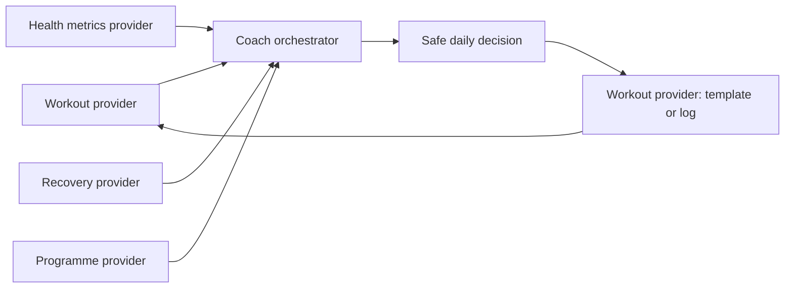

# CoachOS

CoachOS is a provider-based fitness-coaching framework for agents. It separates data collection, programme design, recovery assessment, and workout delivery so no single metric can make an unsafe training decision.

It ships without personal workouts, credentials, API keys, body data, or provider-specific secrets.

## Architecture

| Skill | Responsibility |
| --- | --- |
| `workout-provider` | Read completed workouts, normalize sets, and write a future template only when authorized. |
| `health-metrics-provider` | Read sleep, wearable, scale, and subjective data with explicit data-quality checks. |
| `recovery-provider` | Convert readiness, pain, local workload, and trend context into a conservative traffic-light gate. |
| `programme-provider` | Define the training block, exercise constraints, volume targets, and progression rules. |
| `coach-orchestrator` | Merge provider reports, explain the final decision, and close the feedback loop. |

## Quick start

1. Copy `examples/coach-state.example.json` into your private environment.
2. Implement provider adapters for your workout logger, wearable, and equipment.
3. Run provider skills before `coach-orchestrator`.
4. Record completed sessions, then rerun the loop before the next workout.

## Core safety model

The orchestrator decides in this order: pain/illness/instability; same-day readiness; recent local workload; multi-day wearable trends; then the programme. Missing readiness blocks progression and a red decision never creates a training template.

Read [PROGRAMME_PHILOSOPHY.md](PROGRAMME_PHILOSOPHY.md) before configuring a programme.
